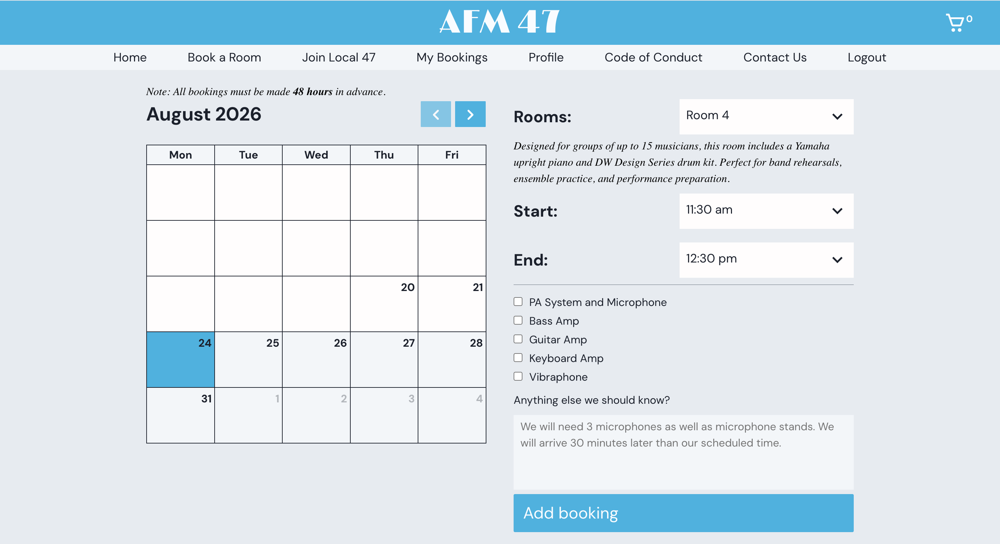
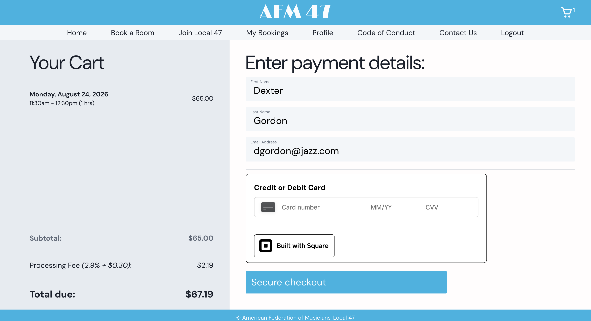

# book47
## Overview
## Screenshots
## Features
## Tech Stack
## Technical Highlights
## Technical Challenges
## Future Improvements

A full-stack rehearsal room reservation application built for AFM Local 47.

### Overview

bookL47 is an in-house web application I created for AFM Local 47 to manage the reservation process for its rehearsal rooms.

The application allows users to browse available rooms, view availability, create reservations, and manage bookings through a centralized web interface.

I built the application from scratch, including both the React frontend and Express backend, using knowledge I developed through nearly a year of studying JavaScript and full-stack web development.

### Screenshots

Calendar and Reservation Selection

Checkout Page

### Features
- User authentication and authorization
- Rehearsal room browsing and selection
- Calendar-based availability
- Room reservations
- Booking management
- Payment processing through Square
- Google Calendar integration
- Role-based functionality
- Timezone-aware booking logic
- Persistent database storage

### Tech Stack
#### Frontend
- React
- JavaScript
- CSS
#### Backend
- Node.js
- Express
- Passport
- JSON Web Token (JWT)
#### Database
- PostgreSQL
- Supabase
#### APIs & Integrations
- Square API
- Google API

### Technical Highlights

This project was a major step in moving from studying individual JavaScript concepts to building a complete application.

In particular, I gained experience with:

- Designing and consuming REST APIs
- Authentication and authorization
- PostgreSQL database design and queries
- Asynchronous JavaScript
- React component architecture
- Managing application state
- Working with third-party APIs
- Date and timezone handling
- Debugging problems across the frontend, backend, and database
- Structuring a full-stack application

### Technical Challenges

The most challenging part of the project was developing the booking logic.

Reservations involve multiple dates, times, room availability constraints, and timezone conversions. I had to become comfortable working with JavaScript Date objects, converting between timezones, and building conditional logic around different booking and availability boundaries.

The booking system also needed to prevent conflicting reservations while accounting for the different room configurations and reservation rules.

Working through these problems gave me significantly more experience with date manipulation, asynchronous API calls, database queries, and designing application logic around real-world constraints.

### Future Improvements

Some areas I would like to improve as the application continues to develop include:

- Improving automated testing
- Adding polished animations
- Expanding error handling
- Improving accessibility
- Refining the user experience
- Further separating application logic into reusable services and components

**Status**

This project was developed as an in-house application for AFM Local 47 and is continuing to evolve as requirements change.
